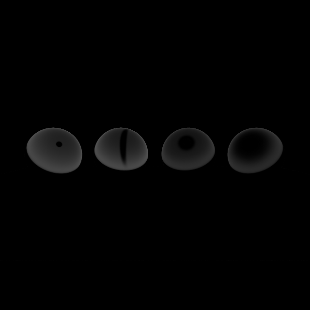

# Comparação: LambDiff

- **Variante:** `/mnt/c/Users/MSI/Desktop/Uni/5ano2sem(atrasadas)/Projeto-CG/build/apps/result/reference.ppm`
- **Referência:** `/mnt/c/Users/MSI/Desktop/Uni/5ano2sem(atrasadas)/Projeto-CG/build/apps/result/standard.ppm`
- **Data:** 2026-06-04
- **Resolução:** 640×640

## Métricas per-canal

| Métrica | R | G | B | Y |
|---|---|---|---|---|
| RMSE | 0.063922 | 0.060668 | 0.055970 | 0.060289 |
| MAE  | 0.014437 | 0.014887 | 0.012209 | 0.014563 |
| Max  | 0.584314 | 0.501961 | 0.600000 | 0.507294 |

## Métricas adicionais

| Métrica | Valor |
|---|---|
| RMSE legacy Y (fórmula antiga) | 0.00009420 |
| MinMaxScaled RMSE Y | 0.00009805 |
| PSNR Y | 24.40 dB (diferença visível) |
| SSIM Y | 0.9741 |
| ΔE CIE76 médio | 1.84 (ligeiro) |
| ΔE CIE76 máx | 59.88 |

## Referência — estatísticas de luminância

| | Valor |
|---|---|
| Y min | 0.0275 |
| Y max | 0.9883 |
| Y mean | 0.2137 |

## Histograma de \|ΔY\|

| Intervalo | Píxeis |
|---|---|
| [0, 1e-4) | 375923 |
| [1e-4, 1e-3) | 882 |
| [1e-3, 1e-2) | 2589 |
| [1e-2, 1e-1) | 5221 |
| [1e-1, 0.2) | 11693 |
| [0.2, 0.3) | 7873 |
| [0.3, 0.5) | 5418 |
| [0.5, 0.7) | 1 |
| [0.7, 1.0) | 0 |
| [1.0, ∞) overflow | 0 |

## Imagem-diferença

