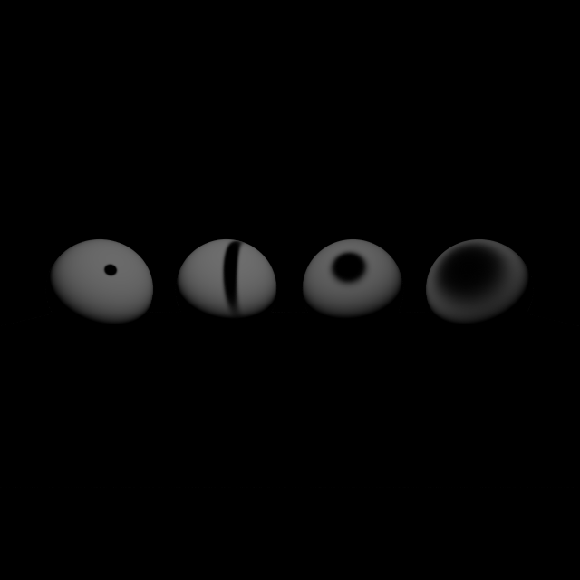

# Comparação: NoDiff

- **Variante:** `/mnt/c/Users/MSI/Desktop/Uni/5ano2sem(atrasadas)/Projeto-CG/build/apps/result/reference.ppm`
- **Referência:** `/mnt/c/Users/MSI/Desktop/Uni/5ano2sem(atrasadas)/Projeto-CG/build/apps/result/standard.ppm`
- **Data:** 2026-06-04
- **Resolução:** 640×640

## Métricas per-canal

| Métrica | R | G | B | Y |
|---|---|---|---|---|
| RMSE | 0.124814 | 0.116571 | 0.133024 | 0.117565 |
| MAE  | 0.027089 | 0.027064 | 0.031284 | 0.027320 |
| Max  | 0.874510 | 0.745098 | 0.972549 | 0.753924 |

## Métricas adicionais

| Métrica | Valor |
|---|---|
| RMSE legacy Y (fórmula antiga) | 0.00018370 |
| MinMaxScaled RMSE Y | 0.00019119 |
| PSNR Y | 18.59 dB (muito diferente) |
| SSIM Y | 0.9341 |
| ΔE CIE76 médio | 4.09 (perceptível) |
| ΔE CIE76 máx | 88.71 |

## Referência — estatísticas de luminância

| | Valor |
|---|---|
| Y min | 0.0275 |
| Y max | 0.9883 |
| Y mean | 0.2137 |

## Histograma de \|ΔY\|

| Intervalo | Píxeis |
|---|---|
| [0, 1e-4) | 376347 |
| [1e-4, 1e-3) | 801 |
| [1e-3, 1e-2) | 1967 |
| [1e-2, 1e-1) | 4989 |
| [1e-1, 0.2) | 4526 |
| [0.2, 0.3) | 3636 |
| [0.3, 0.5) | 6387 |
| [0.5, 0.7) | 9306 |
| [0.7, 1.0) | 1641 |
| [1.0, ∞) overflow | 0 |

## Imagem-diferença

