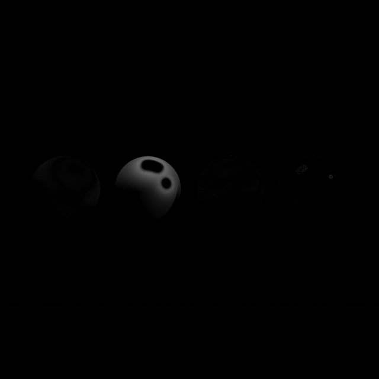

# Comparação: D_Blinn-Phong

- **Variante:** `/mnt/c/Users/MSI/Desktop/Uni/5ano2sem(atrasadas)/Projeto-CG/build/apps/result/reference.ppm`
- **Referência:** `/mnt/c/Users/MSI/Desktop/Uni/5ano2sem(atrasadas)/Projeto-CG/build/apps/result/standard.ppm`
- **Data:** 2026-06-03
- **Resolução:** 640×640

## Métricas per-canal

| Métrica | R | G | B | Y |
|---|---|---|---|---|
| RMSE | 0.043712 | 0.037170 | 0.024484 | 0.037618 |
| MAE  | 0.004833 | 0.004169 | 0.002886 | 0.004216 |
| Max  | 0.854902 | 0.729412 | 0.482353 | 0.738253 |

## Métricas adicionais

| Métrica | Valor |
|---|---|
| RMSE legacy Y (fórmula antiga) | 0.00005878 |
| MinMaxScaled RMSE Y | 0.00006066 |
| PSNR Y | 28.49 dB (diferença visível) |
| SSIM Y | 0.9858 |
| ΔE CIE76 médio | 0.55 (imperceptível) |
| ΔE CIE76 máx | 85.86 |

## Referência — estatísticas de luminância

| | Valor |
|---|---|
| Y min | 0.0275 |
| Y max | 0.9964 |
| Y mean | 0.2129 |

## Histograma de \|ΔY\|

| Intervalo | Píxeis |
|---|---|
| [0, 1e-4) | 380542 |
| [1e-4, 1e-3) | 2298 |
| [1e-3, 1e-2) | 13203 |
| [1e-2, 1e-1) | 9220 |
| [1e-1, 0.2) | 1276 |
| [0.2, 0.3) | 894 |
| [0.3, 0.5) | 1372 |
| [0.5, 0.7) | 766 |
| [0.7, 1.0) | 29 |
| [1.0, ∞) overflow | 0 |

## Imagem-diferença

