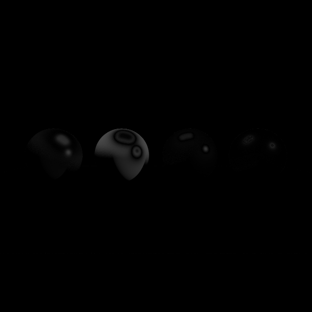

# Comparação: F_exacto

- **Variante:** `/mnt/c/Users/MSI/Desktop/Uni/5ano2sem(atrasadas)/Projeto-CG/build/apps/result/reference.ppm`
- **Referência:** `/mnt/c/Users/MSI/Desktop/Uni/5ano2sem(atrasadas)/Projeto-CG/build/apps/result/standard.ppm`
- **Data:** 2026-06-03
- **Resolução:** 640×640

## Métricas per-canal

| Métrica | R | G | B | Y |
|---|---|---|---|---|
| RMSE | 0.025382 | 0.027215 | 0.075544 | 0.026731 |
| MAE  | 0.003871 | 0.004254 | 0.011112 | 0.004271 |
| Max  | 0.439216 | 0.431373 | 0.890196 | 0.407975 |

## Métricas adicionais

| Métrica | Valor |
|---|---|
| RMSE legacy Y (fórmula antiga) | 0.00004177 |
| MinMaxScaled RMSE Y | 0.00004311 |
| PSNR Y | 31.46 dB (diferença ligeira) |
| SSIM Y | 0.9857 |
| ΔE CIE76 médio | 1.43 (ligeiro) |
| ΔE CIE76 máx | 93.78 |

## Referência — estatísticas de luminância

| | Valor |
|---|---|
| Y min | 0.0275 |
| Y max | 0.9964 |
| Y mean | 0.2129 |

## Histograma de \|ΔY\|

| Intervalo | Píxeis |
|---|---|
| [0, 1e-4) | 376329 |
| [1e-4, 1e-3) | 1208 |
| [1e-3, 1e-2) | 10470 |
| [1e-2, 1e-1) | 15565 |
| [1e-1, 0.2) | 3618 |
| [0.2, 0.3) | 1651 |
| [0.3, 0.5) | 759 |
| [0.5, 0.7) | 0 |
| [0.7, 1.0) | 0 |
| [1.0, ∞) overflow | 0 |

## Imagem-diferença

