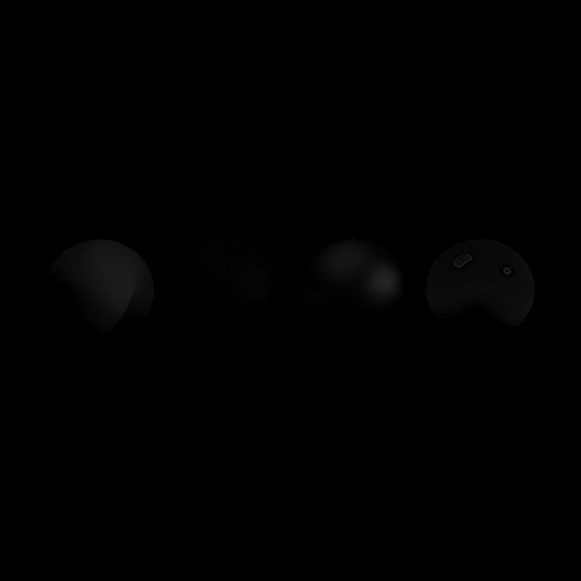

# Comparação: F_invertido

- **Variante:** `/mnt/c/Users/MSI/Desktop/Uni/5ano2sem(atrasadas)/Projeto-CG/build/apps/result/reference.ppm`
- **Referência:** `/mnt/c/Users/MSI/Desktop/Uni/5ano2sem(atrasadas)/Projeto-CG/build/apps/result/standard.ppm`
- **Data:** 2026-06-03
- **Resolução:** 640×640

## Métricas per-canal

| Métrica | R | G | B | Y |
|---|---|---|---|---|
| RMSE | 0.023335 | 0.014048 | 0.012661 | 0.014785 |
| MAE  | 0.004656 | 0.003102 | 0.002425 | 0.003234 |
| Max  | 0.352941 | 0.211765 | 0.235294 | 0.225656 |

## Métricas adicionais

| Métrica | Valor |
|---|---|
| RMSE legacy Y (fórmula antiga) | 0.00002310 |
| MinMaxScaled RMSE Y | 0.00002384 |
| PSNR Y | 36.60 dB (diferença ligeira) |
| SSIM Y | 0.9974 |
| ΔE CIE76 médio | 0.75 (imperceptível) |
| ΔE CIE76 máx | 36.25 |

## Referência — estatísticas de luminância

| | Valor |
|---|---|
| Y min | 0.0275 |
| Y max | 0.9964 |
| Y mean | 0.2129 |

## Histograma de \|ΔY\|

| Intervalo | Píxeis |
|---|---|
| [0, 1e-4) | 376145 |
| [1e-4, 1e-3) | 1126 |
| [1e-3, 1e-2) | 6805 |
| [1e-2, 1e-1) | 23127 |
| [1e-1, 0.2) | 2395 |
| [0.2, 0.3) | 2 |
| [0.3, 0.5) | 0 |
| [0.5, 0.7) | 0 |
| [0.7, 1.0) | 0 |
| [1.0, ∞) overflow | 0 |

## Imagem-diferença

