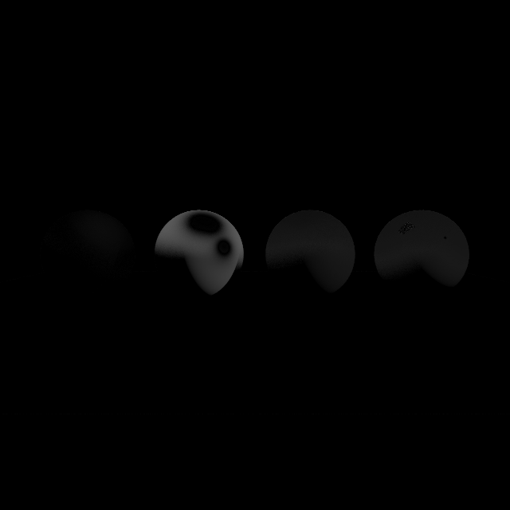

# Comparação: KD_lerp

- **Variante:** `/mnt/c/Users/MSI/Desktop/Uni/5ano2sem(atrasadas)/Projeto-CG/build/apps/result/reference.ppm`
- **Referência:** `/mnt/c/Users/MSI/Desktop/Uni/5ano2sem(atrasadas)/Projeto-CG/build/apps/result/standard.ppm`
- **Data:** 2026-06-03
- **Resolução:** 640×640

## Métricas per-canal

| Métrica | R | G | B | Y |
|---|---|---|---|---|
| RMSE | 0.045763 | 0.041986 | 0.034121 | 0.041749 |
| MAE  | 0.008336 | 0.008532 | 0.006924 | 0.008293 |
| Max  | 0.631373 | 0.541176 | 0.356863 | 0.546211 |

## Métricas adicionais

| Métrica | Valor |
|---|---|
| RMSE legacy Y (fórmula antiga) | 0.00006523 |
| MinMaxScaled RMSE Y | 0.00006733 |
| PSNR Y | 27.59 dB (diferença visível) |
| SSIM Y | 0.9854 |
| ΔE CIE76 médio | 1.28 (ligeiro) |
| ΔE CIE76 máx | 60.33 |

## Referência — estatísticas de luminância

| | Valor |
|---|---|
| Y min | 0.0275 |
| Y max | 0.9964 |
| Y mean | 0.2129 |

## Histograma de \|ΔY\|

| Intervalo | Píxeis |
|---|---|
| [0, 1e-4) | 375878 |
| [1e-4, 1e-3) | 760 |
| [1e-3, 1e-2) | 4685 |
| [1e-2, 1e-1) | 17159 |
| [1e-1, 0.2) | 6421 |
| [0.2, 0.3) | 2212 |
| [0.3, 0.5) | 2232 |
| [0.5, 0.7) | 253 |
| [0.7, 1.0) | 0 |
| [1.0, ∞) overflow | 0 |

## Imagem-diferença

