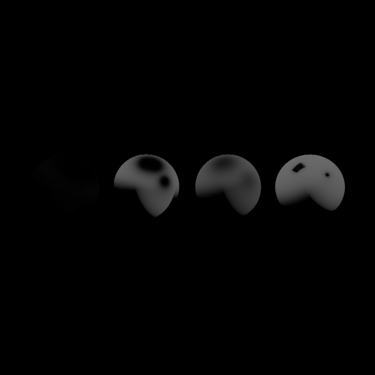

# Comparação: KD_mettalic

- **Variante:** `/mnt/c/Users/MSI/Desktop/Uni/5ano2sem(atrasadas)/Projeto-CG/build/apps/result/reference.ppm`
- **Referência:** `/mnt/c/Users/MSI/Desktop/Uni/5ano2sem(atrasadas)/Projeto-CG/build/apps/result/standard.ppm`
- **Data:** 2026-06-03
- **Resolução:** 640×640

## Métricas per-canal

| Métrica | R | G | B | Y |
|---|---|---|---|---|
| RMSE | 0.081249 | 0.099598 | 0.150828 | 0.098203 |
| MAE  | 0.017076 | 0.021783 | 0.032747 | 0.021561 |
| Max  | 0.733333 | 0.752941 | 0.972549 | 0.723493 |

## Métricas adicionais

| Métrica | Valor |
|---|---|
| RMSE legacy Y (fórmula antiga) | 0.00015344 |
| MinMaxScaled RMSE Y | 0.00015837 |
| PSNR Y | 20.16 dB (diferença visível) |
| SSIM Y | 0.9486 |
| ΔE CIE76 médio | 3.35 (perceptível) |
| ΔE CIE76 máx | 88.71 |

## Referência — estatísticas de luminância

| | Valor |
|---|---|
| Y min | 0.0275 |
| Y max | 0.9964 |
| Y mean | 0.2129 |

## Histograma de \|ΔY\|

| Intervalo | Píxeis |
|---|---|
| [0, 1e-4) | 375900 |
| [1e-4, 1e-3) | 563 |
| [1e-3, 1e-2) | 5396 |
| [1e-2, 1e-1) | 5568 |
| [1e-1, 0.2) | 2596 |
| [0.2, 0.3) | 4765 |
| [0.3, 0.5) | 8706 |
| [0.5, 0.7) | 5639 |
| [0.7, 1.0) | 467 |
| [1.0, ∞) overflow | 0 |

## Imagem-diferença

