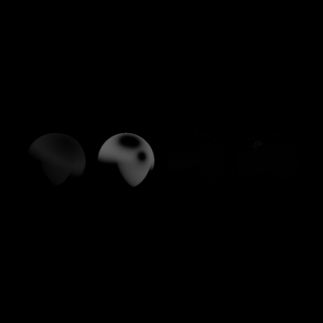

# Comparação: NoEc

- **Variante:** `/mnt/c/Users/MSI/Desktop/Uni/5ano2sem(atrasadas)/Projeto-CG/build/apps/result/reference.ppm`
- **Referência:** `/mnt/c/Users/MSI/Desktop/Uni/5ano2sem(atrasadas)/Projeto-CG/build/apps/result/standard.ppm`
- **Data:** 2026-06-02
- **Resolução:** 640×640

## Métricas per-canal

| Métrica | R | G | B | Y |
|---|---|---|---|---|
| RMSE | 0.055795 | 0.049543 | 0.038159 | 0.049733 |
| MAE  | 0.007685 | 0.007545 | 0.006320 | 0.007486 |
| Max  | 0.737255 | 0.627451 | 0.423529 | 0.635506 |

## Métricas adicionais

| Métrica | Valor |
|---|---|
| RMSE legacy Y (fórmula antiga) | 0.00007771 |
| MinMaxScaled RMSE Y | 0.00008020 |
| PSNR Y | 26.07 dB (diferença visível) |
| SSIM Y | 0.9840 |
| ΔE CIE76 médio | 1.03 (ligeiro) |
| ΔE CIE76 máx | 69.92 |

## Referência — estatísticas de luminância

| | Valor |
|---|---|
| Y min | 0.0275 |
| Y max | 0.9964 |
| Y mean | 0.2129 |

## Histograma de \|ΔY\|

| Intervalo | Píxeis |
|---|---|
| [0, 1e-4) | 376504 |
| [1e-4, 1e-3) | 879 |
| [1e-3, 1e-2) | 14649 |
| [1e-2, 1e-1) | 9978 |
| [1e-1, 0.2) | 1914 |
| [0.2, 0.3) | 1169 |
| [0.3, 0.5) | 3515 |
| [0.5, 0.7) | 992 |
| [0.7, 1.0) | 0 |
| [1.0, ∞) overflow | 0 |

## Imagem-diferença

