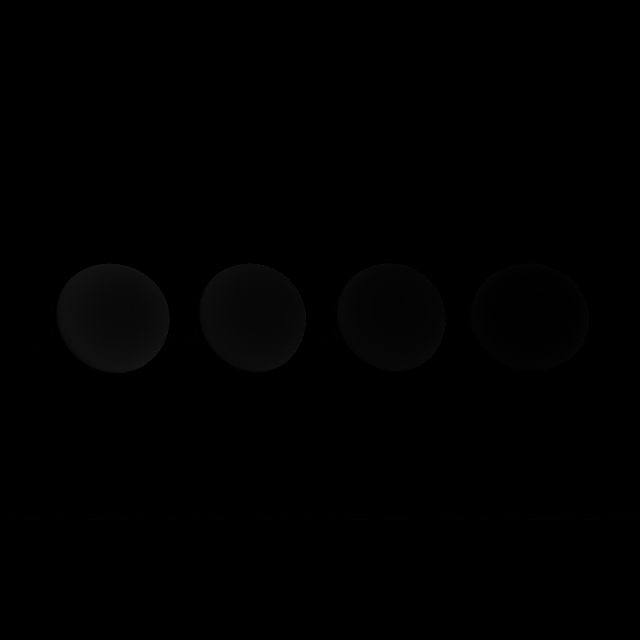

# Comparação: Fujii

- **Variante:** `/mnt/c/Users/MSI/Desktop/Uni/5ano2sem(atrasadas)/Projeto-CG/build/apps/result/reference.ppm`
- **Referência:** `/mnt/c/Users/MSI/Desktop/Uni/5ano2sem(atrasadas)/Projeto-CG/build/apps/result/standard.ppm`
- **Data:** 2026-06-03
- **Resolução:** 640×640

## Métricas per-canal

| Métrica | R | G | B | Y |
|---|---|---|---|---|
| RMSE | 0.013007 | 0.011168 | 0.008841 | 0.011385 |
| MAE  | 0.003434 | 0.002949 | 0.002341 | 0.003008 |
| Max  | 0.137255 | 0.117647 | 0.094118 | 0.120117 |

## Métricas adicionais

| Métrica | Valor |
|---|---|
| RMSE legacy Y (fórmula antiga) | 0.00001779 |
| MinMaxScaled RMSE Y | 0.00002331 |
| PSNR Y | 38.87 dB (diferença ligeira) |
| SSIM Y | 0.9992 |
| ΔE CIE76 médio | 0.31 (imperceptível) |
| ΔE CIE76 máx | 13.71 |

## Referência — estatísticas de luminância

| | Valor |
|---|---|
| Y min | 0.0252 |
| Y max | 0.7885 |
| Y mean | 0.2393 |

## Histograma de \|ΔY\|

| Intervalo | Píxeis |
|---|---|
| [0, 1e-4) | 369894 |
| [1e-4, 1e-3) | 189 |
| [1e-3, 1e-2) | 6920 |
| [1e-2, 1e-1) | 32592 |
| [1e-1, 0.2) | 5 |
| [0.2, 0.3) | 0 |
| [0.3, 0.5) | 0 |
| [0.5, 0.7) | 0 |
| [0.7, 1.0) | 0 |
| [1.0, ∞) overflow | 0 |

## Imagem-diferença

